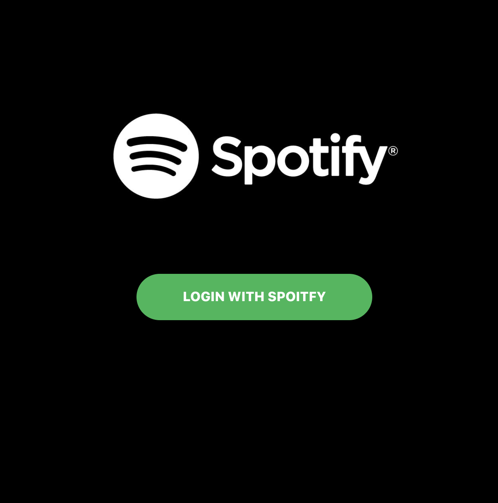
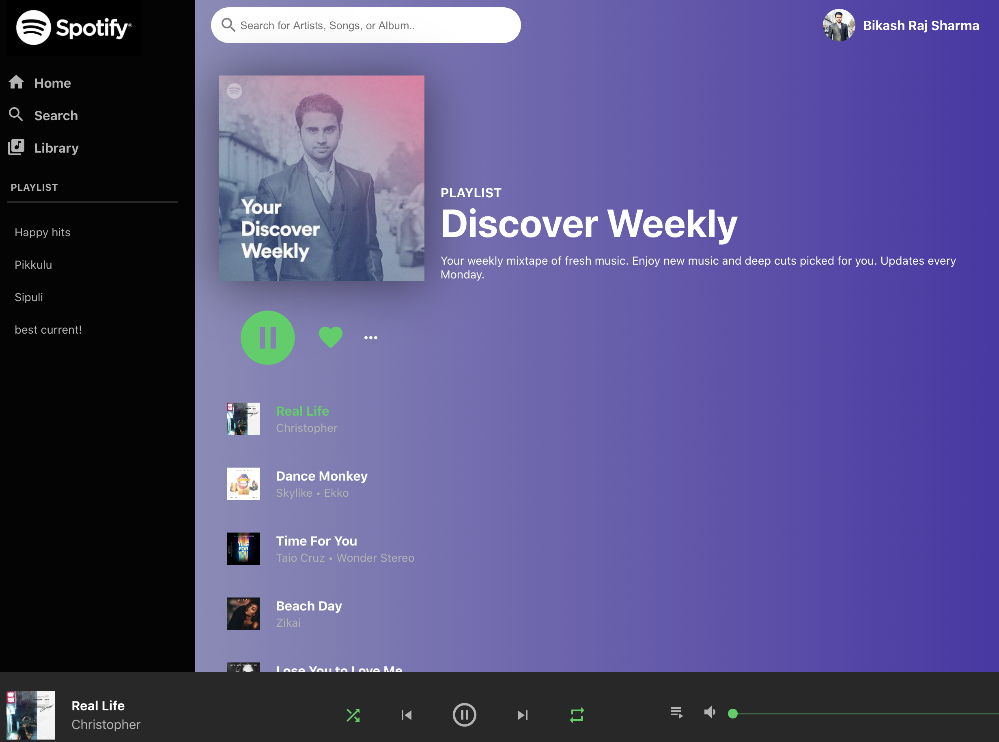

## Spotify Clone 
This is a Spotify clone version. Inspired by cleverprogrammer's clone project. 
#### Live link 
Note: Due to the limitation of Spotify's API you need to have the Spotify Premium account to run this. Also, it may not show you discover weekly correctly.  
#### Features
+ Sidebar with real playlist fetched from user's Spotify.
+ Play or pause the "Discover Weekly" playlist. 
+ Lists all the tracks from the playlist.
+ Acts as remote. You can play or pause your Spotify mobile or web app's player via this clone.

#### Technology
+ React
+ React Context API
+ Spotify Web API
+ Material UI icons
+ CSS (Flex), BEM 
+ DevOps Netlify

### Run Instruction
+ Clone this repo or download
+ run `npm install`
+ run `npm start`
+ Change config.js under the util folder with your CLIENT_ID. Get it from https://developer.spotify.com/
+ Change weekly discover playlist id to yours. For example: https://open.spotify.com/playlist/{DISCOVER_WEEKLY_ID}

#### Login Screen

#### Preview

